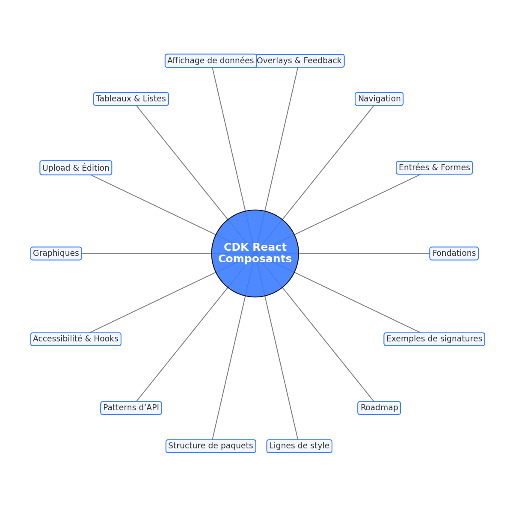

# Liste avancée de composants & primitives pour un CDK React themable

> Tokens → Theme → Primitives → Headless → Components → Presets → Playground.  




## 1) Fondations (indispensables)
- **ThemeProvider** (context + CSS variables) : modes `light/dark/system`, `density`, `radius`, `motion`, `brand`.
- **Design Tokens** : couleurs, typo, spacing, radius, shadow, z-index, breakpoints, durées, easings, opacité.
- **Primitives layout** : `Box`, `Stack`, `Inline`, `Grid`, `Cluster` (avec props de spacing raccourcies).
- **Text** : rôles (`body, label, caption, code`), `truncate`, `align`, `weight`.
- **Icon** polymorphe, `aria-hidden` par défaut.
- **Portal**, **FocusRing/FocusScope**, **VisuallyHidden**.
- **DismissableLayer**, **Positioner**, **Motion primitives** (`Fade`, `Slide`, `Collapse`).
- **RTL/I18n utilities**.

---

## 2) Entrées & Formes
- **Button** : variantes `solid/soft/outline/ghost`, états `loading`, `danger`, `icon-only`.
- **IconButton**, **Link**.
- **Input / Textarea** (+ **Field** wrapper).
- **Select / Combobox** (headless + stylés).
- **Checkbox / Switch / RadioGroup** (tri-state).
- **Slider / RangeSlider**, **NumberField**.
- **DatePicker / DateRangePicker**.
- **ColorPicker**, **FileUpload/Dropzone**.
- **RichText (lab)** minimal.

---

## 3) Navigation & Organisation
- **AppBar / Toolbar** avec slots.
- **Tabs** (roving tabindex, orientation).
- **Accordion** (single/multiple).
- **Breadcrumbs** (responsive).
- **Pagination** (mobile compact).
- **Menu / ContextMenu**, **Command Palette**.
- **SideNav / TreeView**.

---

## 4) Overlays & Feedback
- **Tooltip**, **Popover**.
- **Dialog / Modal** (focus trap, a11y).
- **Drawer** (left/right/bottom).
- **Toast / Snackbar**.
- **Progress / Spinner / Skeleton**.
- **Alert / Banner**, **EmptyState**.

---

## 5) Affichage de données
- **Avatar** avec fallback.
- **Badge / Tag / Chip**.
- **Kbd**, **Code**, **Separator**, **Stat**.
- **Card** (slots header/media/content/footer).

---

## 6) Tableaux & Listes
- **Table** basique + tokens.
- **DataTable (headless)** : tri, filtre, pagination, sélection, virtualisation.
- **List / VirtualList**, **DetailsList**.

---

## 7) Upload, DnD & Édition
- **Sortable** (liste/grid, souris+clavier).
- **Resizable / Splitter**.
- **InlineEdit**.

---

## 8) Graphiques (primitives “chart-ready”)
- **ChartSurface** : axes, grille, tooltip headless.
- **Axis / Grid / Legend / Tooltip**.
- **Series primitives** (`LineSeries`, `BarSeries`, `AreaSeries`, `ScatterSeries`).

---

## 9) Accessibilité & Comportements (Hooks headless)
- **useId**, **useControllableState**.
- **useRove**, **useFocusVisible**.
- **useOutsideClick**, **useEscapeKey**, **useFocusTrap**.
- **useDisclosure**, **usePresence**.
- **useFloatingPosition**.
- **useListNavigation**, **useSelection**.
- **useVirtualizer**.
- **usePrefersReducedMotion**, **useColorScheme**.

---

## 10) Patterns d’API (cohérence CDK)
- **Polymorphic `as`** (`asChild` inclus).
- **Props standardisées** : `variant`, `size`, `tone`.
- **Controlled vs Uncontrolled** (`value/onValueChange` + `defaultValue`).
- **Slots explicites** (`prefix`, `suffix`, `icon`, `actions`).
- **State classes / data-attributes** (`data-state="open"`).
- **CSS Variables thématiques** (`--button-bg`, `--card-border`).
- **ARIA first**, **tests a11y**.

---

## 11) Structure de paquets (suggestion)
- `@cdk/tokens` — tokens JSON + TS.
- `@cdk/theme` — ThemeProvider, CSS vars.
- `@cdk/primitives` — Box, Stack, Text, Icon, Portal.
- `@cdk/headless` — hooks & machines de comportement.
- `@cdk/components` — version stylée “opinion légère”.
- `@cdk/lab` — expérimentaux (RichText, Charts).
- `@cdk/icons` — set minimal d’icônes UI.
- `@cdk/presets` — thèmes prêts à l’emploi.

---

## 12) Lignes directrices de style
- **Radius** par défaut `8px`.
- **Ombres** diffuses (`rgba(0,0,0,.12-.24)`).
- **Accent unique** générant ses variantes (HSL).
- **Densité** contrôlée via `--control-height`.
- **Focus visible** (anneau 2px accent).
- **Transitions** `150–200ms`.

---

## 13) Roadmap pragmatique
1. **Primitives & ThemeProvider**.
2. **Button, Input, Field, Tooltip, Dialog, Menu**.
3. **Select/Combobox, Tabs, Accordion, Toast**.
4. **Table Headless + Virtualizer**.
5. **DatePicker, FileUpload, Drawer**.
6. **DataTable stylée, Command Palette, Splitter, Sortable**.
7. **Charts primitives (Lab)**.

---

## 14) Exemples de signatures
```tsx
<Button variant="soft" tone="primary" size="md" loading asChild>
  <Link to="/checkout">Payer</Link>
</Button>

<Field label="Email" hint="Nous ne partagerons pas votre email" error={error}>
  <Input placeholder="vous@exemple.fr" prefix={<Icon at="mail" />} />
</Field>

<Dialog open={open} onOpenChange={setOpen}>
  <Dialog.Trigger asChild><Button>Ouvrir</Button></Dialog.Trigger>
  <Dialog.Content>
    <Dialog.Title>Titre</Dialog.Title>
    <Dialog.Description>Texte descriptif…</Dialog.Description>
    <Dialog.Footer>
      <Button variant="ghost" onClick={() => setOpen(false)}>Annuler</Button>
      <Button tone="primary">Confirmer</Button>
    </Dialog.Footer>
  </Dialog.Content>
</Dialog>

<Combobox
  value={value}
  onValueChange={setValue}
  items={cities}
  itemToString={(c) => c.name}
/>
